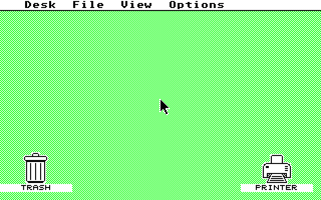

# Phase 2 — Time

**Gate: the 200 Hz tick runs and `_hz_200` increments at the correct rate. Met.**

Measured, not inferred. A boot that completes proves nothing about the
rate: at 100 Hz or 400 Hz EmuTOS boots identically, `tickcal()` still
returns its hardcoded 20 ms, the AES still caches that as
`gl_ticktime`, and every timeout is simply proportionally wrong forever
with no diagnostic.

```
_hz_200:  694 -> 2774   2080 ticks / 10.401s  =  199.99 Hz   (-0.01%)
_frclock: 173 ->  693    520 ticks / 10.400s  =   50.00 Hz   (-0.00%)
```

Sampled from the guest system variables at `0x4BA` and `0x466` over the
QEMU monitor, differenced against host wall clock. Reproduce with
`tools/measure-tick.py`.

## Design

The machine has **no periodic timer**. goldfish-rtc provides a
free-running nanosecond counter and a *one-shot* alarm with no
auto-reload, so a periodic tick has to be rebuilt by re-arming inside
every interrupt.

**Two RTC instances exist** (`VIRT_GF_RTC_NB` is 2, at `0xff006000` and
`0xff007000`). That is enough to run the 200 Hz system tick and the VBL
as genuinely independent sources rather than dividing one out of the
other, which is closer to how Amiga and Lisa provide their VBL.

Both hang off PIC #6 — RTC 0 on bit 0, RTC 1 on bit 1 — so they share
autovector 6 and the handler reads `GF_PIC_IRQ_PENDING` to demultiplex.
Both can be pending at once.

### Drift

Each timer advances its deadline from the **previous deadline**, never
from "now", so handler latency cannot accumulate into the rate.

### Catch-up is bounded, and why

Arming an alarm already in the past does not schedule a QEMU timer — it
calls `goldfish_rtc_interrupt()` **synchronously from the ALARM_LOW
write** (`hw/rtc/goldfish_rtc.c:76-79`). So a late re-arm re-raises
`irq_pending` from inside the handler, microseconds after it was
cleared. An unbounded "advance until future" loop would therefore
convert one late tick into an interrupt storm rather than recover from
it.

Past `QEMUVIRT_CATCHUP_MAX` (64) the deadline is resynced to the present
and `rtc_resync[]` is incremented. That case is not a late handler —
it is a suspended host or a VM stopped in a debugger, where the gap can
be hours. An hour of laptop sleep is 720,000 missed ticks; walking those
would be a storm lasting as long as the outage.

Resyncing deliberately **drops** the missed ticks, so `_hz_200` runs
slow by exactly the outage. That is counted rather than silent, because
the visible symptom of dropped ticks is a wrong clock and wrong timeouts
much later, which looks nothing like a timer fault. `rtc_skipped[]`
counts ordinary bounded catch-up separately, so the two causes stay
distinguishable.

### Phase stagger

The VBL starts half a tick period out of phase. 200 Hz and 50 Hz divide
exactly, so a shared epoch puts every fourth service window under both
handlers at once — permanently, not occasionally — and the VBL body is
much longer than the tick body. Real hardware gets its irregularity free
from separate oscillators; here it has to be arranged.

### Acknowledgement

**`RTC_CLEAR_INTERRUPT` (+0x1c) is the write that deasserts the line.**
It is the only one that clears `irq_pending`, and the line follows
`irq_pending & irq_enabled` (`goldfish_rtc_update`, `:46-49`).
`RTC_CLEAR_ALARM` (+0x14) only does `timer_del` and clears
`alarm_running` — it never touches `irq_pending`.

Both are written anyway: CLEAR_ALARM is free and does cancel a stale
alarm at init. But it is *not* what prevents a storm, and recording that
distinction here is the point — otherwise a future storm gets blamed on
the wrong register.

### Tail into the tick handler

The stub tails into `vector_5ms` rather than jumping at `_int_timerc`
directly. That pointer is what the `_5MS` cookie publishes
(`bios/machine.c:806`), so FreeMiNT can still hook the tick in Phase 6.

The target is **pushed and returned to** rather than loaded into a
register: `_int_timerc` ends in `rte`, not `rts`, and never comes back,
so a register clobbered after the `movem` restore would never be
repaired. Pushing leaves the exception frame exactly where that `rte`
expects it.

`int_vbl()` is called as an ordinary subroutine — it is `rts`-terminated
whenever `CONF_WITH_ATARI_VIDEO` is 0 (`bios/vectors.S:492-496`), which
is how MACHINE_LISA reaches it too.

## What actually boots

Far more than the gate asked for. The trace runs 1123 lines and ends at
`AES: EMUDESK: evnt_multi()` — BDOS, VDI, AES and EMUDESK all initialise
and the AES event loop runs.



That image is the **guest framebuffer**, pulled out of ST-RAM with
`memsave` and decoded — no display hardware is involved and virtio-gpu
does not exist yet. The VDI has been rendering into RAM all along.

Reproduce with `tools/grab-framebuffer.py`. Format is Atari 4-plane
interleaved at 320x200: each group of 16 pixels is 4 consecutive
big-endian words, one per bitplane, MSB leftmost. `v_bas_ad` is reported
in the boot trace.

**The mouse pointer being drawn is end-to-end proof the VBL works.**
`vb_draw` is installed into `vblqueue[0]` by `vdi/vdi_mouse.c:602` and
runs from nowhere else; the mouse interrupt path only sets coordinates.

This also reframes Phase 4. It is not "add graphics" — it is "make an
existing framebuffer visible", which is a much smaller problem.

## Golden boot trace

`tests/golden/boot-phase2.log` is the 1123-line trace at this commit.
Compare a new run with:

```sh
tools/compare-boot-trace.sh new-trace.log
```

The comparator masks addresses and sizes before diffing. Any change to
code size moves the whole memory map, so raw comparison is pure noise;
what is worth locking is the **sequence** of initialisation steps. A
later change that perturbs init order then shows up as a diff here
rather than as a mystery three phases downstream.

## Files

| File | Role |
|---|---|
| `bios/qemuvirt.h` | goldfish-pic and goldfish-rtc register maps |
| `bios/qemuvirt.c` | deadline tracking, arm/ack, `qemuvirt_init_system_timer()` |
| `bios/qemuvirt2.S` | level 6 handler, demux and tail into `vector_5ms` |
| `bios/mfp.c` | `#elif defined(MACHINE_QEMU_VIRT)` arm in `init_system_timer()` |

EmuTOS commit `67dcdda1` on branch `shinogi`.

## Still open

`USE_STOP_INSN_TO_FREE_HOST_CPU` defaults to 1 and executes `STOP` in
the initinfo wait, the boot delay, and `vsync()`. With the tick live
that is fine — and evidently is, since boot completes — but it means the
timer keeps boot *alive* past initinfo, not merely accurate. If QEMU's
`STOP` ever misbehaves, `MACHINE_LISA` sets the precedent for disabling
it (`include/config.h:620-623`).

Wall-clock time-of-day is not wired. `gettime()` returns
`DEFAULT_DATETIME` — the build date at midnight. Nothing hangs; adding a
`qemuvirt_getdt()` arm to `bios/clock.c` alongside the Amiga and Lisa
ones would fix it whenever it matters.
